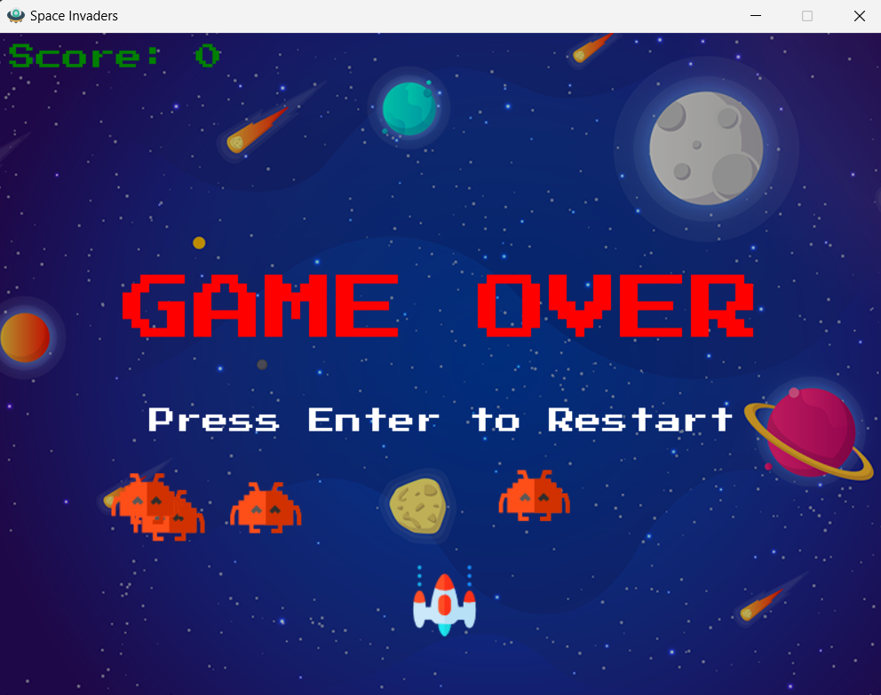

# 🚀 Space Invaders - Python & Pygame 🎮




---

## 🌟 Descripción | Description 🌟

**Español**  
¡Bienvenido a Space Invaders! Este es un clásico juego de arcade recreado en Python utilizando la biblioteca Pygame. Controla tu nave espacial, destruye a los invasores alienígenas y alcanza la mayor puntuación posible. 🎯  

**English**  
Welcome to Space Invaders! This is a classic arcade game recreated in Python using the Pygame library. Control your spaceship, destroy alien invaders, and aim for the highest score. 🎯  

---

## 📋 Características | Features

- 👾 Múltiples enemigos en movimiento.
- 🚀 Disparo de proyectiles con detección de colisiones.
- 🌌 Música de fondo y efectos de sonido.
- 💥 Pantalla de "Game Over" con opción de reiniciar.


- 👾 Multiple moving enemies.
- 🚀 Projectile shooting with collision detection.
- 🌌 Background music and sound effects.
- 💥 "Game Over" screen with restart option.

---

## 🛠️ Instalación | Installation

### 1️⃣ Clona este repositorio | Clone this repository
```bash
git clone https://github.com/nicolascarrica/SpaceInvaders.git
cd SpaceInvaders
```
### 2️⃣ Instala las dependencias | Install the dependencies
```bash
pip install pygame
```
### 3️⃣ Ejecuta el juego | Run the game

```bash
python space_invaders.py
```
## 🎮 Controles | Controls
Flecha izquierda | Left arrow: Mover a la izquierda | Move left

Flecha derecha | Right arrow: Mover a la derecha | Move right

Espacio | Space: Disparar | Shoot

